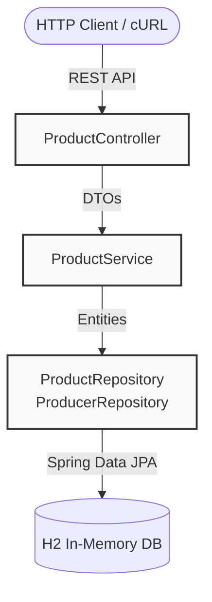

# Product Catalog API

A robust, scalable RESTful API built with Spring Boot for managing a product catalog. The system is designed to handle products with dynamic, schema-less attributes while maintaining strict relational integrity for core business entities.

##  System Architecture

The application strictly follows a multi-tier architecture, ensuring the separation of concerns and maintainability.



## Database schema (ERD)

The database design leverages standard relational mapping alongside PostgreSQL-style JSONB native types (simulated in H2) to allow for infinite horizontal attribute scaling without schema migrations.

```
erDiagram
    PRODUCER ||--o{ PRODUCT : "manufactures"
    PRODUCER {
        bigint id PK
        varchar name
    }
    PRODUCT {
        bigint id PK
        bigint producer_id FK
        varchar name
        varchar description
        decimal price
        json attributes "Dynamic JSON payload"
    }
```

## Key Engineering Decisions

1. Dynamic Attributes Handling: Instead of creating complex EAV (Entity-Attribute-Value) anti-patterns, the product's custom attributes are stored as a native JSON type. This allows for high performance and flexibility while keeping the core schema strict.

2. DTO Pattern & Validation: Total isolation of internal database entities from the external API contract. Strict payload validation (@Valid, jakarta.validation) prevents garbage data from reaching the service layer.

3. Database Versioning: Liquibase is used to manage schema creation and insert initial seed data deterministically.

4. Performance: Pagination is enforced by default (@PageableDefault) on GET endpoints to prevent memory overflow on large datasets. Entity Graphs are used to prevent the N+1 query problem when fetching relations.

## Tech stack

Language: Java 21 LTS

Framework: Spring Boot 3.3.5

Data Access: Spring Data JPA / Hibernate 6

Database: H2 (In-memory)

Migrations: Liquibase

Build Tool: Maven

## How to run

The application is fully self-contained. You do not need a local database instance installed.

1. Ensure you have Java 21+ installed.

2. Clone the repository and navigate to the root directory.

3. Execute the Maven wrapper command:

```bash
./mvnw spring-boot:run
```
The server will start on http://localhost:8080.

## API Usage Examples

### 1. Create a new product (POST)

Demonstrates the insertion of a product with dynamic JSON attributes.

```bash
curl -i -X POST http://localhost:8080/api/v1/products \
-H "Content-Type: application/json" \
-d '{
  "producerId": 1,
  "name": "Cloud Server Instance",
  "description": "High performance compute instance",
  "price": 250.00,
  "attributes": {
    "vCPU": 16,
    "RAM_GB": 64,
    "region": "europe-west3",
    "ssd_storage_gb": 500
  }
}'
```

### 2. Retrieve all products (GET)

Returns a paginated list of products, including their nested producer objects.

```bash
curl -s -X GET "http://localhost:8080/api/v1/products?page=0&size=20" | json_pp
```

(Note: json_pp is used for pretty-printing the output in terminal)


